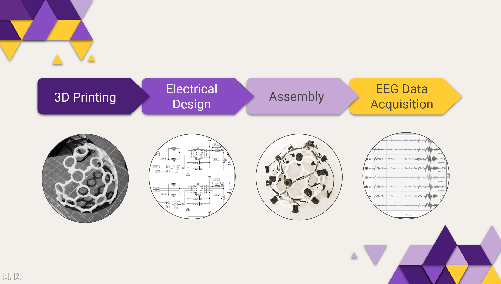
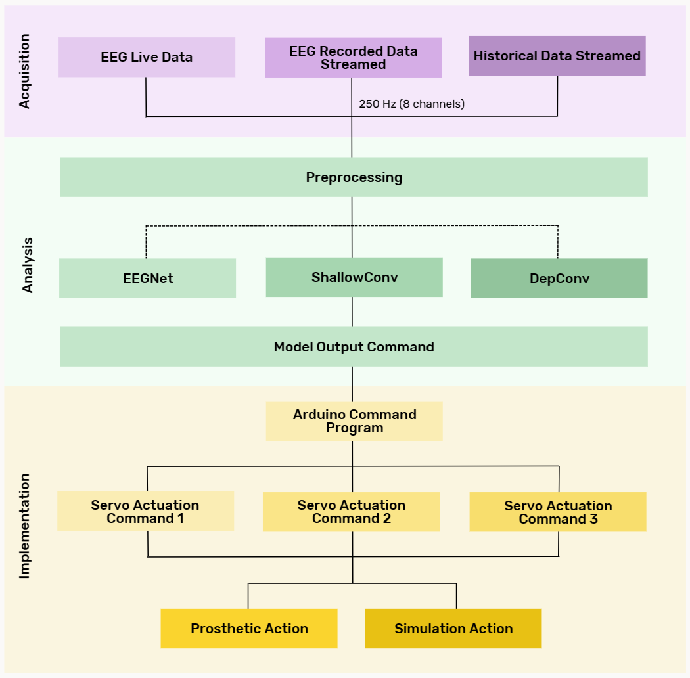
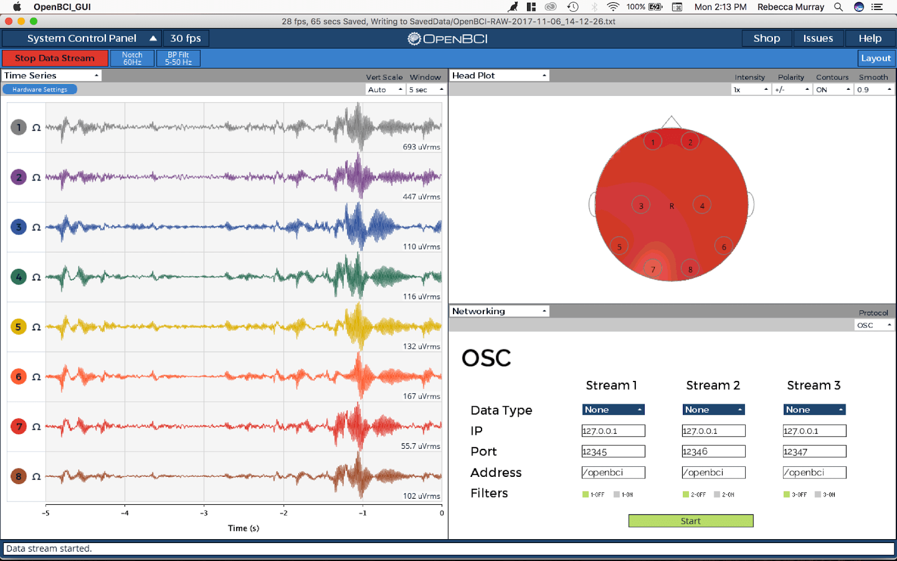
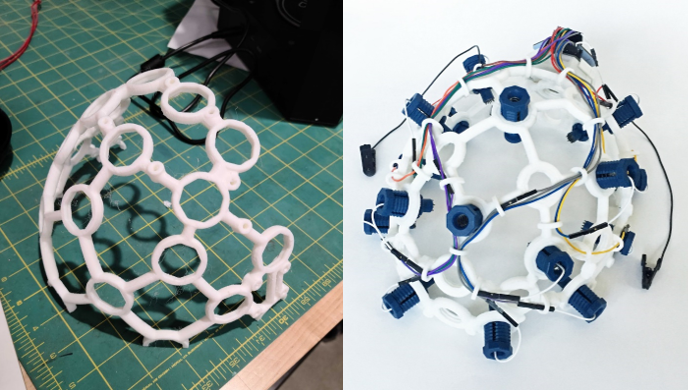

_Overview of our methodology._

### Our Plan

Upon receiving IRB approval, we plan to collect brain signal data from participants using an electroencephalogram (EEG). This acquired data will be used in the analysis phase of our project to generate a model that can recognize features of hand movement, such as opening and closing your right hand. We hope to then implement this by translating the analyzed data into a physical demonstration with an Arduino uArm; and in the future be able to apply it to prosthetic devices.

_Our three step plan._

Through a machine learning assisted BCI, we are working to offer a more functional and practical prosthesis for individuals with limb loss that operates the limbs intuitively and naturally. Our hope is that individuals with limb loss would have greater accessibility to a prosthetic device that would allow them to be able to better engage in daily living activities and live a more comfortable life.

{: .left }{: width="362"}
{: .right }{: width="400"}

[References!](https://docs.google.com/document/d/1XUd4qFouSopQDenw9Kp2ZwUDrdYekCOHYEAsLZgewR4/edit)
