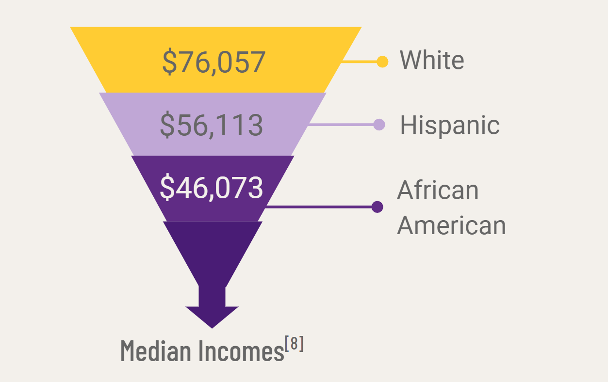

### About our Research

**The purpose of our research is to improve current-day upper-arm prosthetics.** Currently, body-powered and externally-powered myoelectric prostheses (where signals are taken from nerve endings in the upper arm), or a hybrid of the two, are the most popular and widely available options.

We want to maintain the non-intrusive aspects of these prosthetics while improving the accuracy and control of conventional prosthetics. You might be wondering what a **BCI** is? A brain-computer interface (BCI) is a type of neurotechnology that allows for direct communication between our brain and technology. By leveraging an external BCI we can process EEG signals in real time to provide a better experience for the user.

### Research Questions

* How can we build a non-invasive brain-computer interface (BCI) to control a prosthetic limb?

* How can we make a BCI prosthetic that is affordable and accessible while still offering improved quality of life for its user?

* How can we further understand brain wave readings from EEGs?

### The Problem

Throughout our literature review and research process, we uncovered a web of disparities that exist surrounding accessibility to prosthetic devices that can be best explained by examining the intersection between race, socioeconomic status, and healthcare as a whole. 54% of limb loss is due to vascular disease, and we know that marginalized racial identities are at greater risk for developing and sustaining adverse effects of these diseases because of socioeconomic status.5 For example, a statistic from Ohio State University reports that African Americans are 4x more likely to need a prosthetic due to limb loss.5 Furthermore, cosmetic upper-limb prosthetics are upwards of 3k, and functional myoelectric prosthetics, which are often invasive, are upwards of 30k.6 **There is a great need for a new iteration of a prosthetic device that increases accessibility and Team BCIPRO aims to address this.**

{: width="600"}
_A diagram showing the disparities that exist in the world of prosthetic devices._

When we approach lowering the price for prosthetic devices, we are considering two main sources of cost, reading and translating brain signals, and the actual mechanical prosthetic itself. In essence, decreasing the cost to replicate human motion effectively increases accessibility and restores quality of life to marginalized populations. **Our project is not just about prosthetics research, it is about integrating innovative features in devices that solve systematic disparities and spark a greater conversation about medical ethics and healthcare inequity.**

[References!](https://docs.google.com/document/d/1XUd4qFouSopQDenw9Kp2ZwUDrdYekCOHYEAsLZgewR4/edit)

[{: .left}](https://gemstone.umd.edu/)
[{: .right}](http://www.honors.umd.edu)
\
&nbsp;

